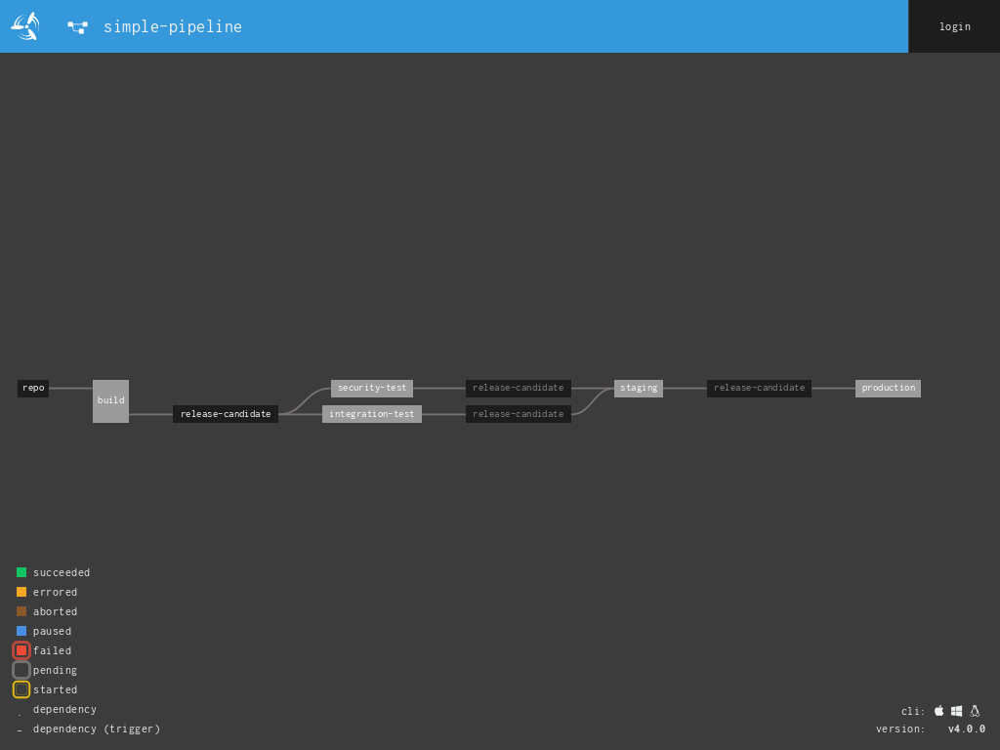
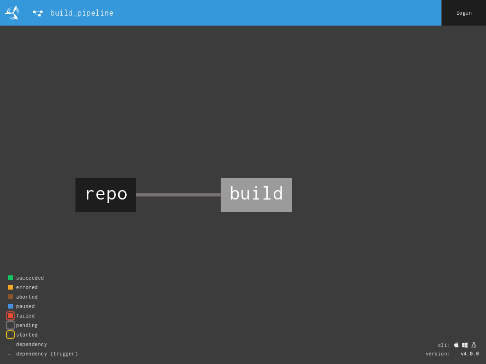
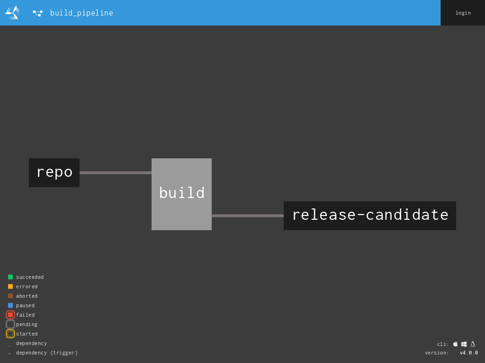

## Introduction
Continuous integration is an important step in ensuring that code is of good quality and works as intended, however well tested code isn't worth much if it's not released and bringing value to users.

Continuous Deployment (CD) is, as the name suggest, the practice of automating the release of software as soon as it's verified to be ready.

A CD pipeline is the name given to an automated process constructed to take a new/updated code and put it through all of the checks and balances necessary to verify it's suitability and to ultimately release that code to production without the need for human intervention.

It may sound obvious to say but releasing software when it's ready is incredibly important!

When a new product is built it is the result of a lot of hard work. E.g. analysis, programming and testing. However until a product is released to it's target audience, all of that effort can be considered wasted activity. Often a new version of a product contains new features that are based on assumptions as to what users want and how they will want to use it. Those assumptions can't be tested until the product is in the users' hands and their feedback can be obtained. Getting feedback on new features is key to driving requirements for subsequent releases. Companies that are able to release software very frequently put themselves at a huge advantage, when compared to competitors who are unable to do so, because they are able to:
- react more quickly
- get feedback more frequently
- de-risk the release process by making each release small

## Learning Objectives
- Learn the features of Concourse that enable building continuous deployment pipelines

## Required knowledge
- basic knowledge of Concourse CI:
  You know how to use the Concourse command line interface (fly) to:
    - Login.
    - Create and trigger pipelines.
    - Navigate the user interface.
- Appreciation of continuous integration.

Don't worry if you need to brush up on either of these things, take a look at the [Introduction to CI](https://github.com/lvl-up/ci-cd-training/tree/master/exercises/CI/introduction_to_ci) exercise to get up to speed.

## Quality Gates
A quality gate represents a milestone that encompasses a set of requirements/standards that must be met to pass it. Although the detail of what is checked will be different from one CD pipeline will be different to the next, most pipelines will have a number of quality gates that have the same overarching objectives:

- **Build/Compilation** - Depending on the language in use, compilation or packaging may be required before anything else can happen. If so this is most likely going to be the first step of the pipeline.

- **Local** - This gate verifies that the test subject works correctly whilst stubbing any downstream system dependencies. Due to the fact that downstream dependencies are stubbed these tests are fast and run predictably. Unit and component tests are examples of the kinds of tests that might run at this level.

- **Integration** - The mandate of this gate is to verify that the test subject works correctly when using real instances of its downstream dependencies.

- **Security** - This gate verifies, as far as is possible through the use of automated tools, that the proposed candidate meets security's requirements. For example checking that the candidate is not using any 3rd party libraries that are considered to contain vulnerabilities.

- **Performance** - Verifies that the release candidate performs as required. E.g. can handle a given number of users.

- **Staging** - The staging environment is an environment that is equivalent/identical to the production environment. I.e. it has equivalent configuration, firewall rules and layout to production. This gate requires proof that the automation required to release the candidate to production environment works correctly.

- **Production** - This is where the release candidate is actually deployed to the production environment.


## Do things in the right order
Verifying that a software product is ready for release can be a lengthy and complex process. The longer you wait to find out that a release candidate is no good, the longer it takes to get to fixing the problem. Therefore, the order that quality gates are set out in is very important. The gates detailed above are in fact specified in a deliberate order. The Local stage is usually the cheapest and fastest to run and requires the simplest environment. Integration testing on the other hand, whilst it provides a greater degree of confidence, takes much longer to run and requires more infrastructure to support it. Therefore in order to justify the expense of integration testing, it is important to be as confident as possible before doing so. Likewise, performance testing can be slow and require an even more complex environment to simulate production load. Therefore, there is no point going to the trouble of running the performance suite until you are confident that the release candidate works in an integrated context.

## Concourse
Concourse is a CI server with a philosophy that EVERYTHING, should be totally portable. I.e. should be possible to move builds to another instance of Concourse without the need for customisation to the server itself. This removes the anxiety that surrounds aging CI server installations, that people rely on but nobody know's how to rebuild should they disappear. Concourse achieves this by putting the onus on users to store and version control configuration and to supply the environments that all commands run on. This includes the ones that are issued by tasks themselves.

Concourse uses [YAML](http://yaml.org/spec/1.2/spec.html) to configure it. YAML is a simple medium for structuring data and is very similar to JSON. Be aware the YAML is white space sensitive. If you get an error when trying to set a pipeline it is usually because something wasn't indented correctly :)

## Tutorial
**Note:** Before going any further do the following:
- `cd YOUR_CLONE_OF_THIS_REPO`
- `source ./bin/env`
- `cd /exercises/CI/continous_deployment_pipelines`
- run `cic up` to bring up the tutorial environment.

**Note:** once you've finished this exercise, don't forget to run the `cic down` to stop your the environment that you've been using for this tutorial.


In order to use Concourse, login by running `./resources/linux/fly -t local login --concourse-url http://127.0.0.1:8080 -u test -p test`


### Overview of Pipelines


A [pipeline](https://concourse-ci.org/pipelines.html) consists of [Resources](https://concourse-ci.org/resources.html) and [Jobs](https://concourse-ci.org/jobs.html) which are groups of [Tasks](https://concourse-ci.org/tasks.html). These elements are strung together to achieve some particular outcome.

The example pipeline above uses these elements to wait for changes to appear in the VCS resource called `repo` and triggers a job called `build` to produce a docker image resource called `release-candidate`. From here `release-candidate` is used in both `security-test` and `integration-test` jobs before it it is deployed to the staging environment using the `staging` job. If `staging` is successful, then and only then is `release-candidate` deployed to the production environment using the `production` job.

By the end of this tutorial you'll have learn't about each of the building blocks mentioned above and have built this pipeline for yourself. Let's get cracking!

### Tasks
Tasks are simply units of work. They can be configured to do what ever you want them to. Let's define our first task.


Write the following content to a file called hello-world-task.yml

```YAML
platform: linux

image_resource:
  type: 'docker-image'
  source: {repository: busybox}

run:
  path: echo
  args: [hello world]


```

now let's get concourse to run this task for us.
run `./resources/linux/fly -t local execute -c hello-world-task.yml`

This should output the following:
```
executing build 1 at http://127.0.0.1:8080/builds/1 
initializing
waiting for docker to come up...
Pulling busybox@sha256:2a03a6059f21e150ae84b0973863609494aad70f0a80eaeb64bddd8d92465812...
sha256:2a03a6059f21e150ae84b0973863609494aad70f0a80eaeb64bddd8d92465812: Pulling from library/busybox
90e01955edcd: Pulling fs layer
90e01955edcd: Verifying Checksum
90e01955edcd: Download complete
90e01955edcd: Pull complete
Digest: sha256:2a03a6059f21e150ae84b0973863609494aad70f0a80eaeb64bddd8d92465812
Status: Downloaded newer image for busybox@sha256:2a03a6059f21e150ae84b0973863609494aad70f0a80eaeb64bddd8d92465812

Successfully pulled busybox@sha256:2a03a6059f21e150ae84b0973863609494aad70f0a80eaeb64bddd8d92465812.

running echo hello world
hello world
succeeded
```

The output communicates the following:

1. The instruction to execute our task has been received
1. The environment that is needed to execute our command has been downloaded
1. The command has been run
1. The output of the command


Let's take a look at the YAML and what it instructed Concourse to do more closely:

The above yaml specified the two things:
- Environment required to run the command on
```
platform: linux

image_resource:
  type: 'docker-image'
  source: {repository: busybox}

```
Earlier we said that Concourse promotes portable builds by requiring the user to supply the environment that all commands run on. The above config is specifying that a Linux type environment is required to run the command and that the environment should be created by using a docker image.

**Note:** 'type' is indented underneath 'image_resource', in [YAML](http://yaml.org/spec/1.2/spec.html) this means that 'type' child of 'image_resource' and is requirerd to be in this position in order to properly describe the 'image_resource' to Concourse.

- The command itself
```
run:
  path: echo
  args: [hello world]

```
The above command is very simple, the echo command is being called with a parameter of 'hello world'

For more information on how tasks can be configured see the [Concourse documentation on Tasks](https://concourse-ci.org/tasks.html)

#### Resources
Resources are how Concourse is told where to get things from and where things can be put. Indeed the above tasks defined a resource:
```
image_resource:
  type: 'docker-image'
  source: {repository: busybox}

```

In the task we defined we earlier, we defined an `image_resource`, this by default is interpreted as a [docker-image-resource](https://github.com/concourse/docker-image-resource). In the [source configuration section](https://github.com/concourse/docker-image-resource#source-configuration) of of the docker-image-resource documentation you will find all of configuration options available for specifying a target docker image.

**Note:**  For now avoid reading any lower than the [source configuration section](https://github.com/concourse/docker-image-resource#source-configuration) as the subsequent documentation specifies how to use the docker-image-resource as an output for publishing docker images.

Another common type of resource are the version control repositories (VCS) from which concourse should pull code.
```YAML
resources:
- name: repo
  type: git
  source:
    uri: ssh://git@git-server/git-server/repos/application-repo.git
    branch: master
```

The above resource configuration defines a resource:
- Named: repo
- Of type: git - This identifies that the [git resource plugin](https://github.com/concourse/git-resource) should be used to access the resource specified.
- who's source can be found at the given URI and on the given branch.

Each resource can be used as an output, the required configuration for doing this is specific to each type of resource. We will look at how to do this for our `release-candidate` docker-image-resource shortly.

### Pipelines and Jobs
Now that we know how to define resources and tasks, we can glue them together with jobs and start to build our pipeline.

#### Declaring Dependencies
First lets configure a pipeline that simply builds our release candidate but doesn't go as far as outputting it to the `release-candidate` resource. In order to do this we will need to define a resource to represent our git repository and a job that is dependant on it.


To do this, write the following YAML to a file called `build_pipeline.yml`:

```YAML
---
resources:
- name: repo
  type: git
  source:
    uri: http://git-server/repo.git
    branch: master
jobs:
- name: build
  plan:
  - get: repo
    trigger: true
  - task: pytest
    config:
      platform: linux
      image_resource:
        type: docker-image
        source:
          repository: lvlup/ci_course_python
      inputs:
      - name: repo
        path: "."
      run:
        path: shovel
        args:
        - build

```

Important things to notice are:
- Repo Resource
    - **source:** This is a privately running repository that was brought up on your machine by the `cic up` command.
- Build Job
  - **plan:get** - Defines a requirement on the `repo` resource declared above.
  - **plan:get:trigger true** - Instructs Concourse that this job will be triggered if a change is made to the repo resource. E.g. a commit is detected.
  - **task** - This is a list of tasks. In our case we have declared a single task which is declared to run the command `shovel build` on a docker-image-resource. This task takes the a copy of the repo resource as input.

Push the pipeline to Concourse by running: `./resources/linux/fly  -t local set-pipeline -p build_pipeline -c build_pipeline.yml -n` and login in to to the [Concourse dashboard](http://127.0.0.1:8080), with the username `test` and password `test`, to see a pipeline that looks as follows:


The Concourse UI [provides a graphical representation](https://medium.com/concourse-ci/concourse-pipeline-ui-explained-87dfeea83553) of pipelines and their state. In our pipeline, the `repo` resource is denoted as a resource by being in a box with a black background. There is a solid line connecting `repo` to `build` which indicates that the changes to `repo` will automatically trigger `build`.


#### Outputs
The next step is to publish our `release-candidate`. Jobs can can be configured to push output to resources. Concourse's [plugin framework](https://Concourse-ci.org/implementing-resources.html) dictates that plugins must provide an `in` and and `out` by which resources can be pulled and pushed respectively. When a job such as the following declares `get: repo`, this is tells Concourse to use the in hook provided by the git-resource plugin to pull a copy of `repo` in to the job.
```YAML
- name: build
  plan:
  - get: repo
    trigger: true
  - task: pytest
    config:
      platform: linux
      image_resource:
        type: docker-image
        source:
          repository: lvlup/ci_course_python
      inputs:
      - name: repo
        path: .
      run:
        path: shovel
        args: [build]


```

Similarly adding the following `put` declaration to the job definition in `build_pipeline.yml` tells Concourse to push a new version of the `release-candidate` resource via the out hook provided by the [docker-image-resource plugin](https://github.com/concourse/docker-image-resource)
```YAML
- put: release-candidate
  params:
    build: repo

```

After adding the above snippet to your YAML you should have a definition that reads as follows:
```YAML
  ---
- name: build
  plan:
  - get: repo
    trigger: true
  - task: pytest
    config:
      platform: linux
      image_resource:
        type: docker-image
        source:
          repository: lvlup/ci_course_python
      inputs:
      - name: repo
        path: "."
      run:
        path: shovel
        args:
        - build
  - put: release-candidate
    params:
      build: repo

```

Re-push the pipeline to Concourse by running: `./resources/linux/fly  -t local set-pipeline -p build_pipeline -c build_pipeline.yml -n`, refresh the browser and you should see that your pipeline looks as follows:



## Now it's your turn.
Believe it or not you have now learnt all that you need to know in order to build the rest of the pipeline we looked at earlier and that is shown below.


Using the what you've learnt so far, and the above image as guidance, declare the rest of the YAML necessary to create this pipeline in Concourse.

The additional jobs should do the following:
- **integration-test** - should run the command 'shovel test.integration' using the `release-candidate`
- **security-test** - should run the command 'shovel test.security' using the `release-candidate`
- **staging** - should run the command `shovel deploy.stage` using the `release-candidate` **only** if there is a version available that made it through the `integration-test` and `security-tests` jobs. Check out the [step passed](https://concourse-ci.org/get-step.html#get-step-passed) documentation for information on how to do this.
- **production** - should run the command 'shovel deploy.production' using the `release-candidate` **only** if there is a version available that made it through the `staging` job.

Have fun and good luck! :)

**Note:** once you've finished the exercise, don't forget to run the `cic down` to stop your the environment that you've been using for this tutorial.

  

Revision: 62aba60e801a463105a732886aa458aa