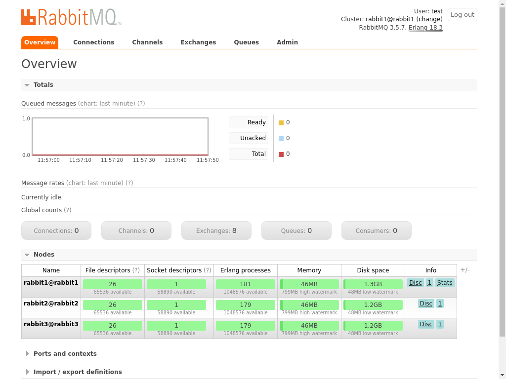

## Introduction
Quite often configuration for servers is very similar barring a few environment specific values.

It is common for servers performing the same functions to have near identical configuration with only minor differences. Consistency in configuration is highly desirable as variations can lead to servers exhibiting different issues which make maintenance problematic. Maintaining duplicate configuration is a low tech solution that is prone to error. Templates that can be used stamp out configuration is an ideal solution in this situation. In this exercise we look at how to write templates in Ansible.

## Learning Objectives
Using Ansible's templating features to make configuration reusable.

## Required prequisite knowledge
Basic knowledge of Ansible

## Getting started
Before going any further run: `cic up` to bring up the test infrastructure needed by this exercise. Once you're finished run: `cic down` to shut everything down.

## Templating in Ansible

Templates are processed using the simple but powerful [Jinja2 Templating engine](http://jinja.pocoo.org/docs/2.10/templates/). Key features that you will find yourself reaching for most often are:

### Expressions `{{}}`
The result of a statement written between nested braces will appear in the rendered output. If you've used variables within a playbook then in fact you've already written simple expressions.


The following example declares a simple template contains an expression that references  the `template_variable` variable. In this case the `template_variable` resolves to the assigned value of "World" which was set in the `vars:` section of the task.


```YAML
---
- name: Inline template example
  hosts: all
  tasks:
    - name: debug message
      vars:
        template_variable: World
      debug: msg="Hello {{template_variable}}"

```

**Note:** The example playbook makes use of what is known as an inline template I.e. the Jinja2 notation is used directly within the input parameter passed within the playbook itself. This is instead of defining the template with an external resource.

Write the above playbook to `ansible/inline_template_playbook.yml`. Running `ansible-playbook ansible/inline_template_playbook.yml -c local` should output the following:

```
PLAY [Inline template example] *************************************************

TASK [Gathering Facts] *********************************************************
ok: [127.0.0.1]

TASK [debug message] ***********************************************************
ok: [127.0.0.1] => {
    "msg": "Hello World"
}

PLAY RECAP *********************************************************************
127.0.0.1                  : ok=2    changed=0    unreachable=0    failed=0   

[ OK ] FINISHED - start container with: cic start cic_container-xxxxxxxxxxxxxxxx
```

In the above output we can see that "Hello World" was outputed.

Expressions can of course be more complicated than simply referencing variables. Jinja2 supports a very python-like syntax, checkout the docs to see what you can do within a expression. Be careful to keep the complexity of the expressions you write to a minimum as it's easy to end up with templates that are hard to maintain.

### Statements ``
Control structures such as if statements and for loops are expressed using the `` notation. As with expressions, complexity can quickly grow when control structures are used, increasing the maintenance and testing overheads. Take care with how you use them!

In the following example a for loop is used to loop through the contents of a list stored in the `users` variable. The code that appears between `` and `%{ forend %}` is executed for each item with in the list.


```YAML
---
- name: for loop example
  hosts: all
  tasks:
    - name: debug message
      vars:
        users:
          - dopey
          - sneazy
          - bashful
      debug:
        msg: |
          
            "Creating user: {{user}}"
          

```

Write the above playbook to the `ansible/for_loop_example.yaml`. Running `ansible-playbook ansible/for_loop_example.yaml -c local` should produce output listing the users defined in the `users` variable.
```
PLAY [for loop example] ********************************************************

TASK [Gathering Facts] *********************************************************
ok: [127.0.0.1]

TASK [debug message] ***********************************************************
ok: [127.0.0.1] => {
    "msg": "  \"Creating user: dopey\"\n  \"Creating user: sneazy\"\n  \"Creating user: bashful\"\n"
}

PLAY RECAP *********************************************************************
127.0.0.1                  : ok=2    changed=0    unreachable=0    failed=0   

[ OK ] FINISHED - start container with: cic start cic_container-xxxxxxxxxxxxxxxx
```

For information on using control statements within Jinja2 checkout the [documentation](http://jinja.pocoo.org/docs/2.10/templates/#list-of-control-structures)


## Ansible's Template module
In line templates are useful, however lengthy strings can become unwieldy to use within a task definition. Another option is to use ansible's [Template module](https://docs.ansible.com/ansible/latest/modules/template_module.html). The Template module allows templates to be split in to files keeping them separate from the tasks within which they are used. Templates are processed using the Jinja2 and all of the same [substitution and computational features](http://jinja.pocoo.org/docs/2.10/templates/) are available in this context.

Let's have a go at using the Template module for ourselves.

Imagine the scenario where different departments support their own environments. It would be useful to tell users of a given environment who they need to contact should they have a support query. The Message of The Day (MOTD) is a banner that is shown to users of UNIX environments when they log in. It is usually configured to display useful information to users and is the perfect place to tell them whom to contact if they have a problem.


Write the following to `ansible/templates/motd`
```
####################################
# Welcome to your shiny new server #
####################################

If you require any support please email: {{support_email_address}}

```

You'll notice the `{{support_email_address}}` variable which has been added to the template. This allows us to specify the support email address at runtime.


Write the following playbook to `ansible/motd_playbook.yml`
```
---
- name: Helpful messages
  hosts: all
  tasks:
    - name: setup motd
      template:
        src: ./templates/motd
        dest: /etc/motd

```

Execute this playbook by running: `ansible-playbook ansible/motd_playbook.yml -i 'newserver,' --extra-vars 'support_email_address=help@me.com'`

Connect to the server by running `cic connect newserver`, then ssh to localhost by running `ssh localhost` and you should see the 'help@me.com' appear in the MOTD.

## Now it's your turn

You have been tasked with setting up a [RabbitMQ](https://www.rabbitmq.com/) cluster.

RabbitMQ is a messaging bus that can be used to send messages from one application to another.

Clustered installations are those that involve two or more servers configured to work together to provide a single service. Clustered installations provide the benefits of being able to handle greater load as well as providing reliance against instance failure.


The following Ubuntu servers are available:

- rabbit1
- rabbit2
- rabbit3

**Note:** you can connect to any of these using the `cic connect` command, e.g. `cic connect rabbit1`

Write an ansible playbook that configures a RabbitMQ cluster with one of these servers being the managing node. Use variables and templates where possible to keep things reusable. i.e. avoid hard coding the managing node name where possible.

### Installing RabbitMQ
Use apt-get to install `rabbitmq-server`.

### Starting RabbitMQ
To start RabbitMQ run: `systemctl start rabbitmq-server` on each of the nodes.

**Note:** Depending on how you configure RabbitMQ you might need to start/restart RabbitMQ for your changes to take affect. Logs are available in `/var/log/rabbitmq` and observing them is a good way to see what's happening within rabbitmq as you start to make configuration changes.

### Name the nodes
Name each of the nodes. E.g. on rabbit1 write the following to `/etc/rabbitmq/rabbitmq-env.conf`
```
NODENAME=rabbit1
```
**Hint:** To avoid repetition, templating might come in useful here.

### Configure the cluster

Each cluster node needs to be configured with the following content written to `/etc/rabbitmq/rabbitmq.config`
```
[
	{ rabbit,
	  [
	    {cluster_nodes, {[ 'managing-node-name@managing-node-name' ], disc}}
	  ]
	}
].

```

**Note:** replace `managing-node-name` for the name of the managing node.

**Hint:** to avoid hard coding the managing node name, use templating instead.

### Set the secret
Nodes are only allowed to be in the cluster if they know the secret. Write a value of your choosing to: `/var/lib/rabbitmq/.erlang.cookie` E.g:
```
it's a secret
```


**Note:**

- The file must be owned by the `rabbitmq` user and also owned by the `rabbitmq` group and have file permissions of '0400'.
- The value of the secret could be provided via a variable, this will allow the same playbook to be used to configure different clusters with different secrets.

### Install the management plugin
In order for the nodes and master to talk to one another the `rabbitmq_management` plugin must be enabled. Do this by running `rabbitmq-plugins enable rabbitmq_management`. Installing the plugin will also make a web admin [interface available](http://localhost:15672/).

### Create an admin user

A user must be created in order order to log in and view the management console.
Run the following commands on the management node:
- create a user called 'test' with a password of 'test': `rabbitmqctl add_user test test`
- Make the `test` user an administrator: `rabbitmqctl set_user_tags test administrator`

**Note:** Feel free to use a username and password of your choosing.


### Verify everything is working!!!
If everything is working then you should be able to login in to the [management console](http://localhost:15672/) with the user created earlier and you should see a graphical representation of the cluster like the following:




The automated tests that accompany this exercise should also pass. Run `pytest` to execute them and you should see:
```
============================= test session starts ==============================
platform linux -- Python 3.7.0, pytest-4.0.0, py-1.7.0, pluggy-0.8.0
rootdir: /vols/pytest_27663, inifile:
plugins: testinfra-1.17.0
collecting ... 
collected 1 item                                                               

tests/test_rabbitmq_cluster.py .                                         [100%]

=========================== 1 passed in 0.04 seconds ===========================
```

**Note:** Don't forget to run `cic down` to shutdown the test infrastructure once you've finished the exercise.

  

Revision: 311fdc61a054d8170b4e467d75aec164